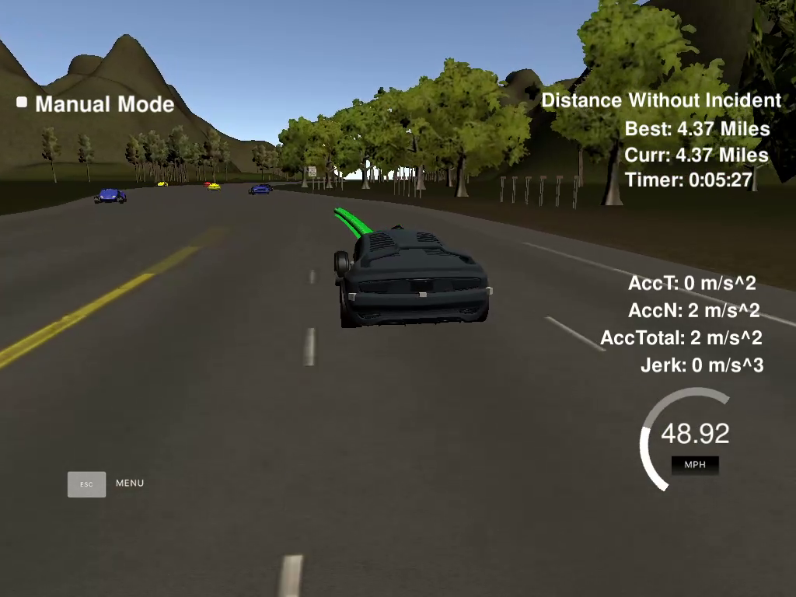

# CarND-Path-Planning-Project
Self-Driving Car Engineer Nanodegree Program

### Goals
In this project your goal is to safely navigate around a virtual highway with other traffic that is driving +-10 MPH of the 50 MPH speed limit. You will be provided the car's localization and sensor fusion data, there is also a sparse map list of waypoints around the highway. The car should try to go as close as possible to the 50 MPH speed limit, which means passing slower traffic when possible, note that other cars will try to change lanes too. The car should avoid hitting other cars at all cost as well as driving inside of the marked road lanes at all times, unless going from one lane to another. The car should be able to make one complete loop around the 6946m highway. Since the car is trying to go 50 MPH, it should take a little over 5 minutes to complete 1 loop. Also the car should not experience total acceleration over 10 m/s^2 and jerk that is greater than 10 m/s^3.



## Code & Algorithm

### 1. Find the lane we need to change or stay in the previous lane according to the sensor data. choose to speed up or slow down.

```shell

if (sense_s-car_s > 0 && sense_s-car_s < safe_distance_front) {
  if (sense_lane == 0) {
      lane0_front = true;
    }
    else if (sense_lane == 1) {
      lane1_front = true;
    }
    else if (sense_lane == 2) {
      lane2_front = true;
    }
}
if (((car_s-sense_s< safe_distance_back) && (car_s-sense_s>0)) || 
    ((sense_s-car_s < safe_distance_front) &&  (sense_s-car_s>0))){
    if (sense_lane == 0) {
      lane0_full = true;
    }
    else if (sense_lane == 1) {
      lane1_full = true;
    }
    else if (sense_lane == 2) {
      lane2_full = true;
    }

}

```
I set the safe distance of the front and the back. Loop all the sensor data to find if the car in the 3 lanes if it were 
in the lane and below the safe distance we need to change lane.If all the lane would be full, we would need to slow down
the car.
### 2. Construct the path points accroding to the future lane. Change from s,d coordinates to Cartesian coordinates.

```shell
path_x.push_back(next_wp0[0]); path_x.push_back(next_wp1[0]); path_x.push_back(next_wp2[0]);
path_y.push_back(next_wp0[1]); path_y.push_back(next_wp1[1]); path_y.push_back(next_wp2[1]);
vector<double> next_wp0 = getXY(car_s + 30, (4*lane+2), map_waypoints_s, map_waypoints_x, map_waypoints_y);
vector<double> next_wp1 = getXY(car_s + 50, (4*lane+2), map_waypoints_s, map_waypoints_x, map_waypoints_y);
vector<double> next_wp2 = getXY(car_s + 60, (4*lane+2), map_waypoints_s, map_waypoints_x, map_waypoints_y);
```
I use the getXY() function in the help function to change the coordinate and vector data structure to store the
waypoint data
### 3. Use spline interpolation to construct the smooth movement path.

```shell
tk::spline s;
s.set_points(path_x, path_y);

for (int i = 1; i <= 50 - previous_path_x.size(); i++) {

  double N = target_dist / (fps * ref_v /2.24);
  double x_p =  target_x / N * i;
  double y_p = s(x_p);
  double x_ref = x_p;
  double y_ref = y_p;

  // Rotate back into previous coordinate system
  x_p = x_ref * cos(ref_yaw) - y_ref * sin(ref_yaw);
  y_p = x_ref * sin(ref_yaw) + y_ref * cos(ref_yaw);

  x_p += ref_x;
  y_p += ref_y;

  next_x_vals.push_back(x_p);
  next_y_vals.push_back(y_p);
}
```
I use the spline function in the spline.h file to make the discrete point continuous to avoid sudden change accelaration and jerk. 
